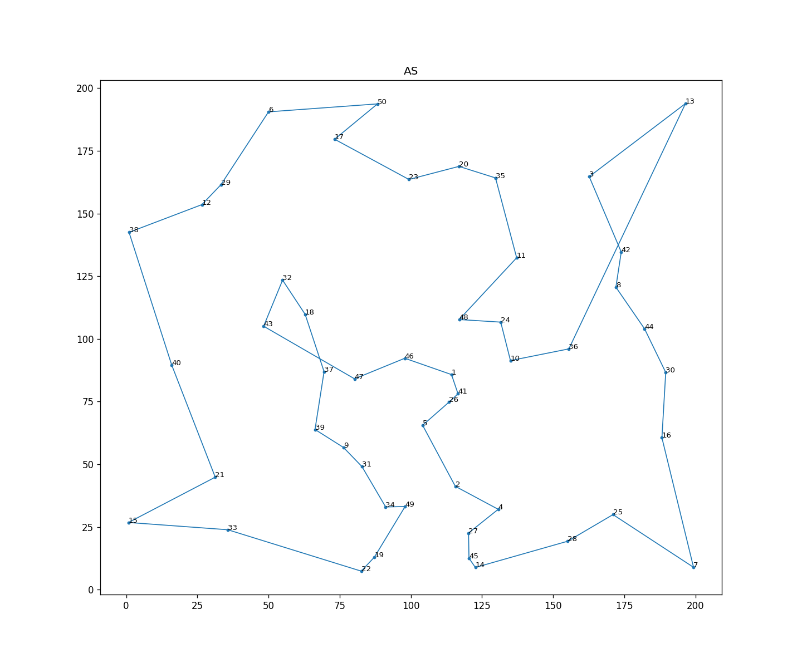
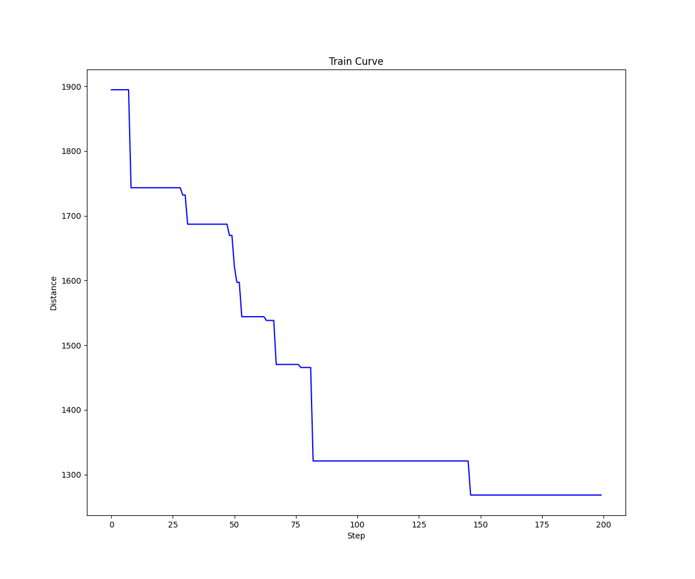
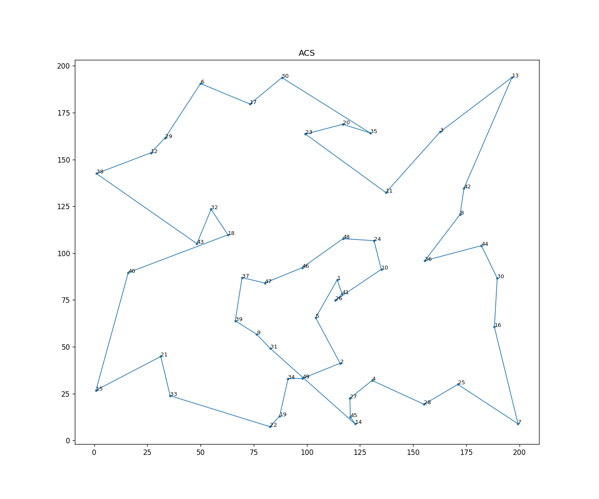
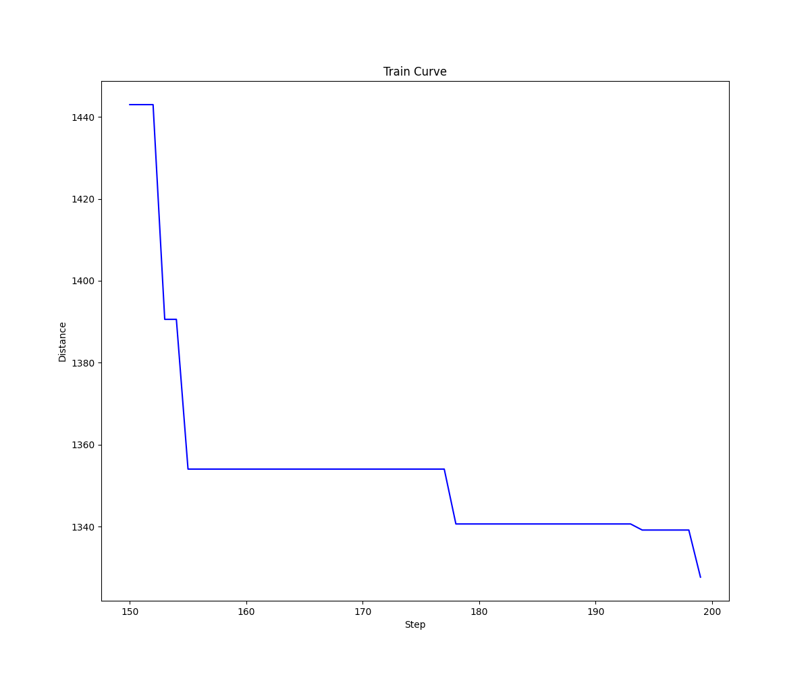
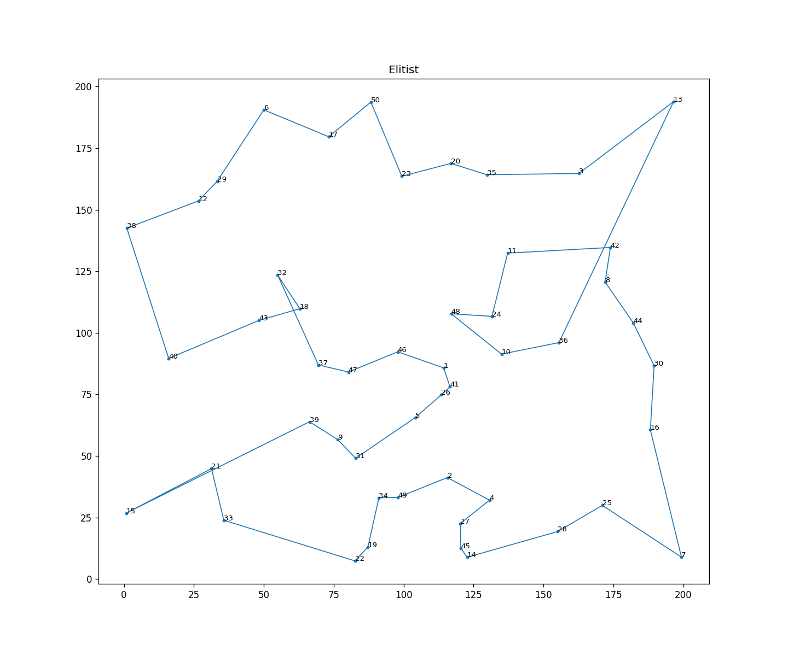
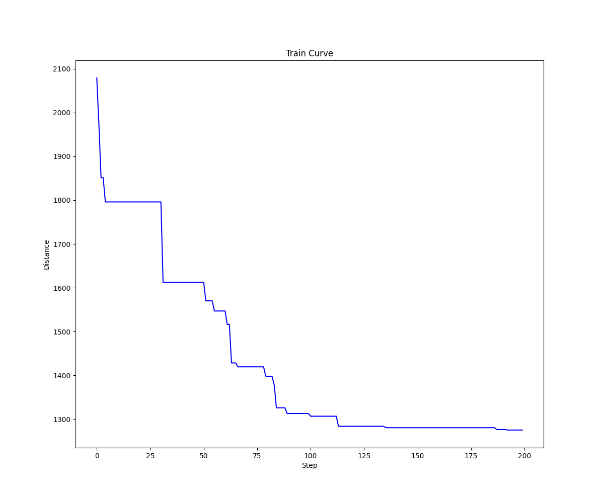
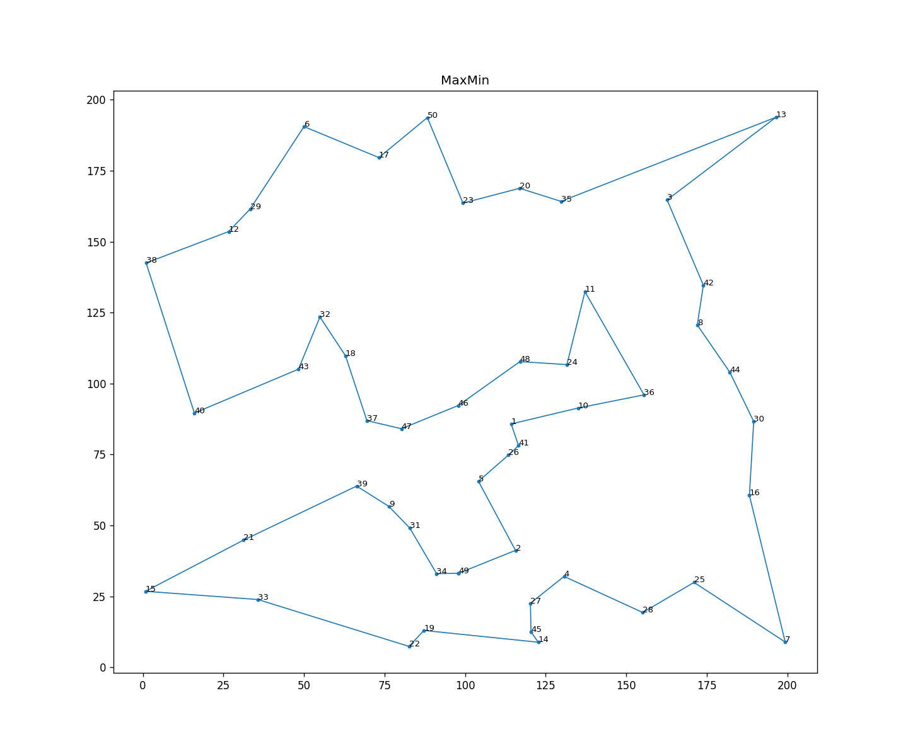
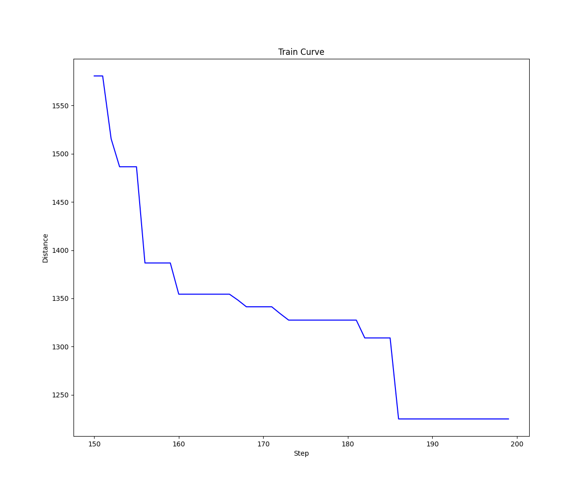

## 【Python Version】 Solving Travelling Salesman Problem using Ant Colony Optimization 

The code in this repository is about the implementation of Ant Colony Optimization (ACO) algorithms based on the content of the paper [1] and referring to the code [2], including the <font color='red'>classical Ant System (AS)</font>, <font color='red'>Ant Colony System (ACS)</font>, <font color='red'>Elitist Ant System</font> and <font color='red'>Max-Min Ant System</font> algorithms.

### Usage

Run:
```python
python3 aco_tsp_new.py
```

Using the following example code implement each of the above algorithms to address the tsp problem.

```python
_colony_size = 5
_steps = 200
random.seed(10)
_nodes = [(random.uniform(0, 200), random.uniform(0, 200)) for _ in range(0, 50)]
print(_nodes)

# AS
as_ = SolveTSPUsingACO(mode='AS', colony_size=_colony_size, steps=_steps, nodes=_nodes)
as_.run()
as_.plot_opt()
as_.plot_tour()

# ACS
acs = SolveTSPUsingACO(mode='ACS', colony_size=_colony_size, steps=_steps, nodes=_nodes)
acs.run()
acs.plot_opt()
acs.plot_tour()

# 精英ACO
elitist = SolveTSPUsingACO(mode='Elitist', colony_size=_colony_size, steps=_steps, nodes=_nodes)
elitist.run()
elitist.plot_opt()
elitist.plot_tour()

# MaxMinACO
max_min = SolveTSPUsingACO(mode='MaxMin', colony_size=_colony_size, steps=_steps, nodes=_nodes)
max_min.run()
max_min.plot_opt()
max_min.plot_tour()
```

#### Output
```
Started : AS
Ended : AS
Sequence : 35 -> 20 -> 23 -> 17 -> 50 -> 6 -> 29 -> 12 -> 38 -> 40 -> 21 -> 15 -> 33 -> 22 -> 19 -> 49 -> 34 -> 31 -> 9 -> 39 -> 37 -> 18 -> 32 -> 43 -> 47 -> 46 -> 1 -> 41 -> 26 -> 5 -> 2 -> 4 -> 27 -> 45 -> 14 -> 28 -> 25 -> 7 -> 16 -> 30 -> 44 -> 8 -> 42 -> 3 -> 13 -> 36 -> 10 -> 24 -> 48 -> 11
Total distance travelled to complete the tour : 1268.29

Started : ACS
Ended : ACS
Sequence : 23 -> 20 -> 35 -> 50 -> 17 -> 6 -> 29 -> 12 -> 38 -> 43 -> 32 -> 18 -> 40 -> 15 -> 21 -> 33 -> 22 -> 19 -> 34 -> 49 -> 2 -> 5 -> 1 -> 41 -> 26 -> 10 -> 24 -> 48 -> 46 -> 47 -> 37 -> 39 -> 9 -> 31 -> 14 -> 45 -> 27 -> 4 -> 28 -> 25 -> 7 -> 16 -> 30 -> 44 -> 36 -> 8 -> 42 -> 13 -> 3 -> 11
Total distance travelled to complete the tour : 1327.67

Started : Elitist
Ended : Elitist
Sequence : 37 -> 47 -> 46 -> 1 -> 41 -> 26 -> 5 -> 31 -> 9 -> 39 -> 15 -> 21 -> 33 -> 22 -> 19 -> 34 -> 49 -> 2 -> 4 -> 27 -> 45 -> 14 -> 28 -> 25 -> 7 -> 16 -> 30 -> 44 -> 8 -> 42 -> 11 -> 24 -> 48 -> 10 -> 36 -> 13 -> 3 -> 35 -> 20 -> 23 -> 50 -> 17 -> 6 -> 29 -> 12 -> 38 -> 40 -> 43 -> 18 -> 32
Total distance travelled to complete the tour : 1274.95

Started : MaxMin
Ended : MaxMin
Sequence : 49 -> 34 -> 31 -> 9 -> 39 -> 21 -> 15 -> 33 -> 22 -> 19 -> 14 -> 45 -> 27 -> 4 -> 28 -> 25 -> 7 -> 16 -> 30 -> 44 -> 8 -> 42 -> 3 -> 13 -> 35 -> 20 -> 23 -> 50 -> 17 -> 6 -> 29 -> 12 -> 38 -> 40 -> 43 -> 32 -> 18 -> 37 -> 47 -> 46 -> 48 -> 24 -> 11 -> 36 -> 10 -> 1 -> 41 -> 26 -> 5 -> 2
Total distance travelled to complete the tour : 1225.1
```

#### Training Plots 
#### 1.AS
  
 

#### 2.ACS
  
 

#### 3.Elitist 
  
 

#### 4.Max-Min
  
 

### Reference
[1] Dorigo M, Birattari M, Stutzle T. Ant colony optimization[J]. IEEE computational intelligence magazine, 2006, 1(4): 28-39.

[2] https://github.com/rochakgupta/aco-tsp

[3] www.theprojectspot.com/tutorial-post/ant-colony-optimization-for-hackers/10


